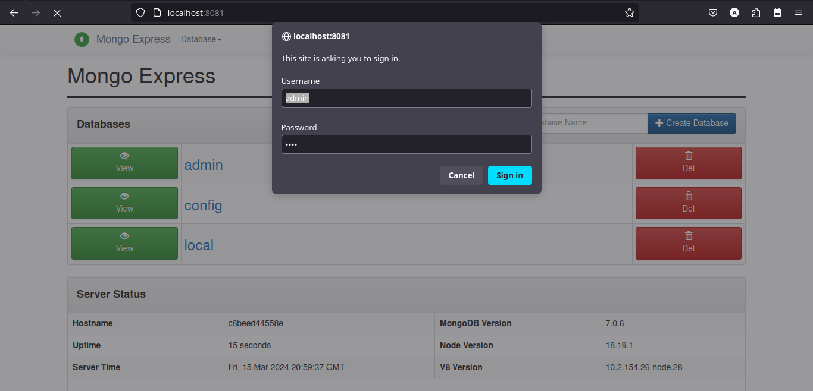

# MEAT APP AUTH

Api de Autenticação para gerenciamento de usuário

## Passos executar a aplicação com docker

* Clone o projeto:

```bash
git clone https://github.com/andresonsouza/meat_app_auth.git
```

* Entre no diretório do projeto:

```bash
cd meat_app_auth
```

* Suba o banco de dados e a aplicação;

```bash
docker-compose up -d
```

* Faça o login no mogo-express

Após os serviços subirem acessar a url abaixo e efetuar o login:

[http://localhost:8081](http://localhost:8081)

Os dados de usuário abaixo são os que vem como padrão de login:


Username: admin
Password: pass



* Para parar a execução basta executar o comando abaixo na raiz do projeto:

```bash
docker-compose down
```
